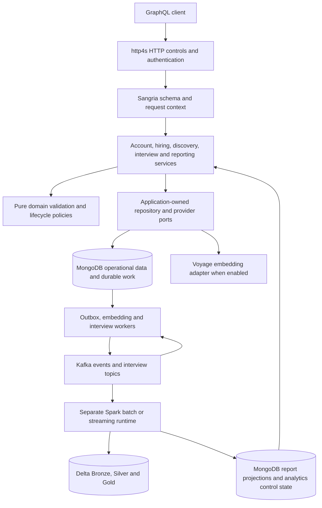

# Hiring platform architecture wiki

This wiki describes the implementation inspected on **2026-10-08**. It connects business use cases to domain rules, services, storage, and operational safeguards. Source links are the implementation reference; the [roadmap](../development-milestones.md) and capability specifications own acceptance and deployment evidence. A feature present in code may require configuration, external infrastructure, or further production qualification.

## Browse the wiki

| Page | Contents |
|---|---|
| [Domain and use cases](domain-and-use-cases.md) | Business entities, value types, lifecycle rules, API operations, and use-case implementation paths |
| [MongoDB and analytics](mongodb-and-analytics.md) | Collection inventory, relationships, constraints, indexes, transactions, retention, and lakehouse datasets |
| [Workflows and design patterns](workflows-and-patterns.md) | Request execution, search, background work, failure recovery, performance mechanisms, and why each pattern exists |
| [Security and operations](security-and-operations.md) | Trust boundaries, access rules, request limits, observability, configuration, and readiness limits |

## System at a glance

The product is a backend for Candidates, Recruiters, and a singleton Admin. The operational application is a modular Scala application with a GraphQL HTTP API and resource-managed workers. MongoDB is the operational source of truth. Kafka transports durable operational events and interview commands/replies. A separate analytics application consumes operational events into Delta Lake and publishes guarded report projections to MongoDB.

Arrows show execution/data flow. Source dependencies point toward domain and service ports: MongoDB, Kafka, HTTP, and provider adapters implement those boundaries. Analytics does not participate in the hiring transaction.

## Modules and technologies

| Boundary | Responsibility | Source |
|---|---|---|
| `domain` | Immutable business values, explicit state transitions, pure decisions; no database or HTTP calls | [Domain source](../../src/main/scala/com/example/graphQL/cats/domain) |
| `service` | Authorization, use-case composition, typed errors, search and durable-work coordination | [Services](../../src/main/scala/com/example/graphQL/cats/service) |
| `service/port` and `service/protocol` | Repository/provider contracts and API-facing use cases | [Ports](../../src/main/scala/com/example/graphQL/cats/service/port), [protocols](../../src/main/scala/com/example/graphQL/cats/service/protocol) |
| `api` | GraphQL types/resolvers, HTTP negotiation/admission, JWT authentication, request-scoped loading | [API](../../src/main/scala/com/example/graphQL/cats/api) |
| `repository/mongo` | BSON mapping, scoped queries, transactions, indexes, validators and migrations | [Mongo adapters](../../src/main/scala/com/example/graphQL/cats/repository/mongo) |
| `infrastructure` | Kafka, embedding provider, JWT issuance, diagnostics and telemetry integrations | [Infrastructure](../../src/main/scala/com/example/graphQL/cats/infrastructure) |
| `runtime` and `Main` | Configuration-driven composition, clients, workers, readiness and server ownership | [Main](../../src/main/scala/com/example/graphQL/cats/Main.scala), [Mongo runtime](../../src/main/scala/com/example/graphQL/cats/runtime/MongoHiringRuntime.scala) |
| `analytics` | Separate Spark/Delta application and its processing/control boundaries | [Analytics build](../../analytics/build.sbt), [analytics architecture](../big-data-architecture.md) |

The [root build](../../build.sbt) selects Scala 3.9.0, Java 17 bytecode, Cats Effect 3, Cats, FS2, Sangria, http4s, Circe, MongoDB reactive streams/mongo4cats, PureConfig and Iron. Kafka uses FS2 Kafka and native Kafka clients. Caffeine caches parsed GraphQL documents; Argon2 hashes passwords; jwt-scala signs/verifies tokens; OpenTelemetry/otel4s and log4cats provide telemetry. MUnit/Cats Effect and Testcontainers support local checks. The analytics build has its own Scala/Spark/Delta dependencies and execution lifecycle.

## Reading a use case through the system

Start with a row in [Domain and use cases](domain-and-use-cases.md), follow its service and domain links, then consult the relevant [MongoDB collection](mongodb-and-analytics.md) and [workflow](workflows-and-patterns.md). For API input/output details use [API documentation](../api.md) and the schema assembled in [HiringGraphQLSchemaAssembly](../../src/main/scala/com/example/graphQL/cats/api/graphql/HiringGraphQLSchemaAssembly.scala). `GET /schema.graphql` exposes generated SDL; `POST /graphql` executes operations.

## Evidence and scope

This is a source-derived description, not an inventory of a running MongoDB deployment or a production certification. Collection names describe what the applications create/use; optional components depend on their flags. Existing [architecture](../../ARCHITECTURE.md), [MongoDB design](../mongodb-design.md), [use cases](../use-cases.md), and [analytics architecture](../big-data-architecture.md) retain their design and acceptance context. Historical examples and SLOs in those documents should be read alongside the current source and dated specification evidence.

The documentation task changes no source, API, data, dependencies, or deployment settings. Its acceptance checks are source-backed coverage of business capabilities, collection inventory, patterns and safeguards; valid local links; and independent documentation review. Runtime test outcomes are reported separately from documentation accuracy and live infrastructure readiness.
