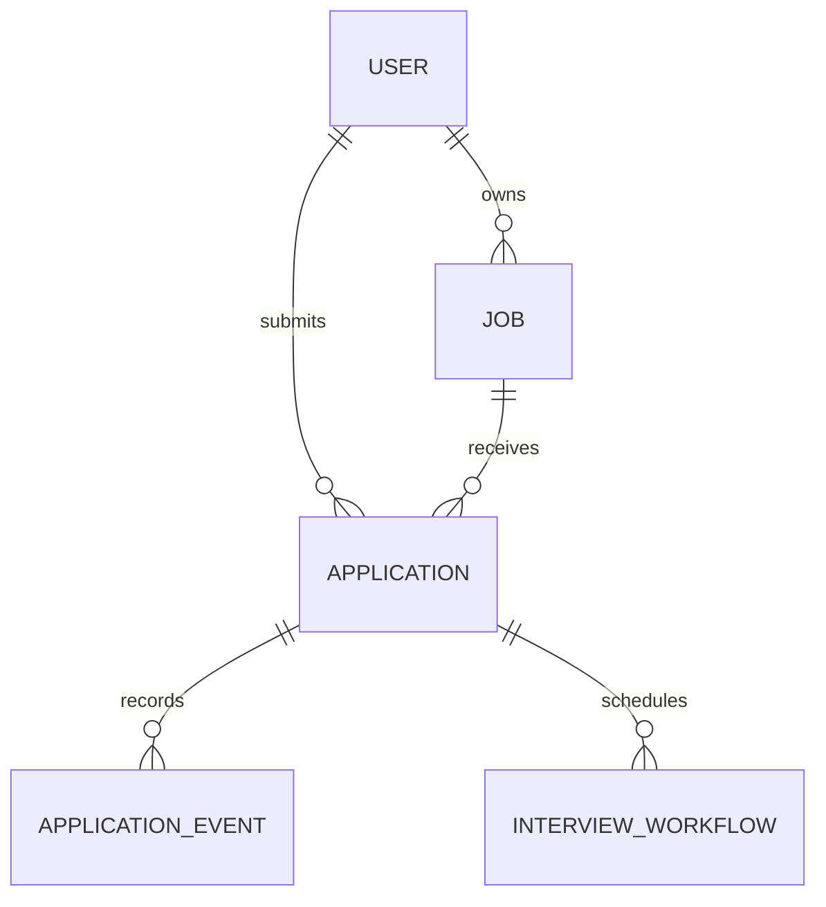

# Domain model and use cases

[Wiki home](README.md) · [Canonical use cases](../use-cases.md) · [Architecture](../../ARCHITECTURE.md)

This page describes the checked-out implementation as of 2026-10-08. “Implemented” means source exists; it does not establish that optional workers, Atlas indexes, Kafka, or analytics are enabled in a deployed environment. The API is backend GraphQL; there is no product frontend in this repository.

## Business model

The core relationship is **Recruiter → Job ← Application → Candidate**. Each application owns an append-only status history. Account identity and credentials support all three roles; only an explicitly provisioned singleton Admin has administrative access. Search embeddings are derived data attached to jobs and candidates. Interview scheduling adds a durable workflow around an application's Accepted → Interview transition.

The diagram expresses references, not SQL foreign keys. MongoDB indexes, transactional repository operations and service authorization enforce the actual constraints.

### Core entities and owned values

| Type | Business meaning and important fields | Source |
|---|---|---|
| `User` | UUID identity, optional email, name, role, role-specific profile, creation time, singleton-admin marker, optional embedding, active/deleted status and deletion time. A deleted account has no profile. | [User.scala](../../src/main/scala/com/example/graphQL/cats/domain/model/User.scala) |
| `UserRole` | Closed role set: `Candidate`, `Recruiter`, `Admin`. There is no active tenant/community role model. | [User.scala](../../src/main/scala/com/example/graphQL/cats/domain/model/User.scala) |
| `CandidateProfile` | Skills, optional experience summary and resume reference, optional residence and availability, and recruiter-search consent. The resume is a reference, not an implemented upload/storage workflow. | [User.scala](../../src/main/scala/com/example/graphQL/cats/domain/model/User.scala) |
| `CandidateResidence`, `CandidateAvailabilityStatus` | Country and optional city; availability is `AVAILABLE_NOW` or `UNAVAILABLE`. These are optional private filter attributes. | [User.scala](../../src/main/scala/com/example/graphQL/cats/domain/model/User.scala) |
| `RecruiterProfile`, `UserProfile` | Organization and optional job title; an ADT associates Candidate/Recruiter profile shapes with their role. Admin has no profile. | [User.scala](../../src/main/scala/com/example/graphQL/cats/domain/model/User.scala) |
| `Job` | Owner recruiter, title, description, requirements, skills, location, Draft/Open/Closed status, creation/update/closure times and optional embedding. | [Job.scala](../../src/main/scala/com/example/graphQL/cats/domain/model/Job.scala) |
| `Location`, `GeoPoint` | Country/city, remote flag and optional latitude/longitude. Coordinate validation rejects non-finite values and values outside latitude ±90 / longitude ±180. | [Job.scala](../../src/main/scala/com/example/graphQL/cats/domain/model/Job.scala) |
| `Application` | Candidate/job reference pair, current status and creation/update times. Creation always starts at `Created`. | [Application.scala](../../src/main/scala/com/example/graphQL/cats/domain/model/Application.scala) |
| `ApplicationEvent` | History identity, application, optional previous status, new status, actor, UTC occurrence time, feedback and reason. Initial history has no previous status. | [Application.scala](../../src/main/scala/com/example/graphQL/cats/domain/model/Application.scala) |
| `JobSubmissionSnapshot` | Minimal job identity/status/revision required to decide submission and guard it against concurrent job changes. | [JobSubmissionSnapshot.scala](../../src/main/scala/com/example/graphQL/cats/domain/model/JobSubmissionSnapshot.scala) |

### Accounts, identifiers and validation

| Type/function | Purpose |
|---|---|
| `UserId`, `JobId`, `ApplicationId`, `ApplicationEventId` | Opaque UUID-backed IDs prevent accidental interchange of entity identities in Scala. [Identifiers](../../src/main/scala/com/example/graphQL/cats/domain/model/Identifiers.scala). |
| `EmailAddress`, `PasswordHash` | Opaque boundary values. `EmailAddress.from` currently validates trimmed nonblank bounded text; it does **not** implement comprehensive email syntax validation. `PasswordHash.fromEncoded` lifts an already encoded hash at the hashing/persistence boundary. [AccountValues](../../src/main/scala/com/example/graphQL/cats/domain/model/AccountValues.scala). |
| `AccountCredentials`, `AccountToken` | Internal user/hash pair and issued token/expiration pair. Credentials are not the public user entity. [Account](../../src/main/scala/com/example/graphQL/cats/domain/model/Account.scala). |
| `AccountName.canonical` | Trims names, applies Unicode NFKC normalization and locale-independent lowercase for account-name matching. [Account](../../src/main/scala/com/example/graphQL/cats/domain/model/Account.scala). |
| `AccountStatus`, `AccountDeletionStatus` | Active/Deleted operational state; deletion receipt query reports Pending/Complete/NotFound. A successful deletion request is not a promise that every asynchronous retention step is already complete. [Deletion status](../../src/main/scala/com/example/graphQL/cats/domain/model/AccountDeletionStatus.scala). |
| `FieldLimits` and `validate*` functions | Accumulate independent input errors using `ValidatedNel`; trim required/optional strings; bound short text to 256 characters, long text to 8192, resume references to 2048, collection values to 100 and password bytes to 1024. Job requirements and skill collections must be nonempty after normalization. [Validation functions](../../src/main/scala/com/example/graphQL/cats/domain/model/User.scala). |
| `PageSize`, cursor/page request types | Public page size is 1–100. Jobs/applications/users use timestamp plus typed ID; application history uses occurrence time plus event ID. Fetching one extra row supports connection continuation. [Pagination](../../src/main/scala/com/example/graphQL/cats/domain/pagination/Pagination.scala). |
| `DomainError`, `DomainValidationError` | Typed expected business and validation failures, translated by services/API instead of exposing storage exceptions. [Domain errors](../../src/main/scala/com/example/graphQL/cats/domain/error/DomainError.scala). |

## Lifecycle rules

### Jobs

`JobLifecycle.create` allows Draft or Open, but rejects initial Closed. `publish` allows **Draft → Open**. `close` allows **Draft → Closed** and **Open → Closed**. Closed → Open and repeated close are invalid. `update` replaces descriptive/location fields and update time without changing status; the pure policy itself does not prohibit editing closed jobs. Authorization is applied separately by `JobService`.

Source: [JobLifecycle](../../src/main/scala/com/example/graphQL/cats/domain/policy/JobLifecycle.scala), [JobService](../../src/main/scala/com/example/graphQL/cats/service/job/JobService.scala).

### Applications

| Current status | Permitted next statuses | Additional rule |
|---|---|---|
| Created | Accepted, Declined, Rejected | Declined needs a nonblank reason; Rejected needs nonblank feedback. |
| Accepted | Interview | Can use the direct action or scheduled interview workflow. |
| Interview | Hired, Rejected | Rejected needs nonblank feedback. |
| Declined | None | Terminal. |
| Hired | None | Terminal. |
| Rejected | None | Terminal. |

`ApplicationSubmission.create` requires a Candidate and an Open job. Persistence additionally enforces candidate/job uniqueness and concurrent-write guards. `ApplicationLifecycle.changeStatus` returns a new application and `StatusChange` containing actor/time/history facts. The service creates the history record and operational events; the repository atomically persists them with the state transition and mutation receipt.

All status actions, including `declineApplication`, currently require the owning Recruiter or singleton Admin. There is no candidate withdrawal action. The generic service `changeStatus` is exposed through action-specific GraphQL mutations, not a public unrestricted status setter.

Source: [ApplicationSubmission](../../src/main/scala/com/example/graphQL/cats/domain/policy/ApplicationSubmission.scala), [ApplicationLifecycle](../../src/main/scala/com/example/graphQL/cats/domain/policy/ApplicationLifecycle.scala), [ApplicationService](../../src/main/scala/com/example/graphQL/cats/service/application/ApplicationService.scala).

## Use-case-to-implementation map

The table lists business operations, rather than every private helper. The authoritative API inventory is [HiringGraphQLSchemaAssembly](../../src/main/scala/com/example/graphQL/cats/api/graphql/HiringGraphQLSchemaAssembly.scala); the application ports are [HiringUseCases](../../src/main/scala/com/example/graphQL/cats/service/protocol/HiringUseCases.scala).

| Use case | Current GraphQL surface | Main implementation and behavior |
|---|---|---|
| [UC01: structured search](../use-cases.md#uc01--search-jobs-by-structured-filters) | `jobs` | `JobService.searchOpenJobs`: visible Open jobs, city/skills/creation-date filters, bounded cursor pagination. |
| [UC02: semantic/hybrid search](../use-cases.md#uc02--semantic--hybrid-job-search) | `semanticJobSearch` | [SemanticSearchService](../../src/main/scala/com/example/graphQL/cats/service/search/SemanticSearchService.scala): bounded query embedding/retrieval, configured fusion, freshness/eligibility validation and authorized entity hydration. |
| [UC03: details](../use-cases.md#uc03--view-job-details) | `job`, `recordJobView` | `JobService.viewJob` authorizes visibility; a separate explicit idempotent mutation records a view. Reading a job is not an implicit analytics write. |
| [UC04: apply](../use-cases.md#uc04--submit-application) | `submitApplication` | `ApplicationService.submitApplication`: Candidate role, open-job snapshot, atomic application/initial history/event/receipt and unique candidate/job pair. |
| [UC05: own applications](../use-cases.md#uc05--view-candidate-applications) | `myApplications`, `applicationHistory` | Candidate-owned list; history access checks application ownership/management and paginates records. |
| [UC06: recommendations](../use-cases.md#uc06--recommend-jobs-to-candidate) | `recommendedJobs` | Candidate-profile embedding supplies the search query; freshness/model checks guard derived vectors and results. |
| [UC07: job management](../use-cases.md#uc07--manage-job) | `createJob`, `updateJob`, `publishJob`, `closeJob`, `myJobs` | `JobService`: active Recruiter/Admin authorization, ownership and explicit lifecycle policy, durable mutation receipts and event/embedding handoff. |
| [UC08: recruiter application list](../use-cases.md#uc08--recruiter-lists-applications-for-job) | `jobApplications` | `ApplicationService.jobApplications`: managed job, authorization scope included in repository selection, bounded status-filtered list. |
| [UC09: application lifecycle](../use-cases.md#uc09--change-application-status) | `acceptApplication`, `declineApplication`, `moveApplicationToInterview`, `hireApplication`, `rejectApplication` | `ApplicationService.changeStatus`: exact matrix above, feedback/reason rules, atomic current status/history/operational facts. Hiring also emits `CANDIDATE_HIRED`. |
| [UC10: candidate matching](../use-cases.md#uc10--semantic-candidate-search) | `candidateMatches` | Managed Open job; optional query and structured candidate filters. Returns minimized candidate search views, not credentials/resume/email/private residence fields. Private filtering obeys consent semantics. |
| [UC11: event publication](../use-cases.md#uc11--publish-and-process-domain-events) | Business mutations plus `recordJobView`, `recordSearchResultClick` | Transactional operational outbox and asynchronous Kafka publication; [OperationalTelemetryService](../../src/main/scala/com/example/graphQL/cats/service/events/OperationalTelemetryService.scala) validates interaction attribution. Search-session handoff supports later clicks. |
| [UC12: hiring funnel](../use-cases.md#uc12--hiring-funnel-analytics) | `analyticsReport(from,to)` | [AnalyticsReportingService](../../src/main/scala/com/example/graphQL/cats/service/AnalyticsReportingService.scala): Admin-only bounded report from guarded analytics projections; Spark/Delta processing is a separate runtime. |
| [UC13: time to hire](../use-cases.md#uc13--time-to-hire-analytics) | `analyticsReport(from,to)` | Same reporting boundary; lifecycle events supply duration measures. Local implementation does not prove production freshness/SLOs. |

### Accounts and supporting queries

These capabilities support the numbered use cases rather than introducing extra UC identifiers.

| Operation | Behavior |
|---|---|
| `signUp` | Public, rate-limited mutation creates Candidate/Recruiter with role-appropriate profile and hashed password. Rejects Admin and rejects signup until the account registry is initialized by bootstrap. |
| `bootstrapAdmin` | Public, rate-limited mutation creates the singleton Admin and returns an authentication token. The transaction requires an Uninitialized account registry and an empty user collection, then marks the registry Initialized. This resolver does not require an existing authenticated actor or a bootstrap secret. |
| `login` | Public, rate-limited account-name/password authentication; successful active-account login returns user and expiring token. |
| `me` | Resolves the authenticated active user. |
| `updateMyProfile` | Updates the current role-appropriate profile and associated derived-search work; Admin profile updates are rejected. |
| `deleteMyAccount` | Requests self-deletion and returns a receipt; Admin deletion is forbidden. Deleted identities can be resolved for authorized deletion replay/status. |
| `accountDeletionStatus` | Checks the caller's receipt and asynchronous cleanup completion. |
| `users` | Admin-only paginated account listing, with account-status and optional role selection. |
| `health`, `readiness` | Runtime health/readiness information, separate from hiring records. |

Sources: [AccountUseCases](../../src/main/scala/com/example/graphQL/cats/service/protocol/AccountUseCases.scala), [account resolvers](../../src/main/scala/com/example/graphQL/cats/api/graphql/HiringGraphQLAccountResolvers.scala), [UserAccountService](../../src/main/scala/com/example/graphQL/cats/service/auth/UserAccountService.scala), [MongoUserRepository](../../src/main/scala/com/example/graphQL/cats/repository/mongo/MongoUserRepository.scala), [ActorAuthorization](../../src/main/scala/com/example/graphQL/cats/service/auth/ActorAuthorization.scala).

## Search and geographic discovery values

| Model | Purpose |
|---|---|
| `SearchMode`, `SearchFusionStrategy` | FILTER/VECTOR/HYBRID describes retrieval mode; ApplicationRrf/MongoRankFusion/MongoScoreFusion describes the configured combination strategy. Availability depends on adapter/configuration and Atlas capabilities. |
| `EntityEmbedding`, `EmbeddingMeta` | Vector plus model identity, source hash and generation time. Source/model provenance is required to detect obsolete representations. |
| `SearchableText` | Deterministic job/profile text preparation, sorting skill sets. Candidate text uses experience and skills, excluding resume references and private residence/availability. Query/document budgets are 2048/12000 characters. |
| `JobSearchFilter`, `VectorSearchQuery` | Typed structured filters and internal vector/lexical query, response size, model and search identity. |
| `SearchRetrievalHit`, `RankedJob`, `RankedCandidate` | Retrieval evidence is separated from hydrated public results. Ranked outputs carry score/mode/model metadata/search ID and matched skills; optional retrieval score preserves the original branch/fusion evidence. |
| `CandidateSearchHit`, `CandidateMatchFilters` | Minimized candidate identity/name/skills/summary; optional required skills, canonical country/city and availability filters. |
| `NearbyJobsQuery`, `NearbyJobCursor`, `NearbyJob` | Radius discovery returns job plus distance. Radius is bounded to 500 km; cursor contains distance/job ID and a query fingerprint to prevent reuse with different filters. |
| `JobFacetQuery`, `JobDiscoveryFacets`, `JobFacetBucket` | Skills/countries/cities/remote counts with a truncation flag and maximum 20 buckets per dimension. No private candidate dimensions are exposed. |

Sources: [Search domain](../../src/main/scala/com/example/graphQL/cats/domain/model/Search.scala), [fusion strategies](../../src/main/scala/com/example/graphQL/cats/domain/search/SearchFusionStrategy.scala), [search contracts](../../src/main/scala/com/example/graphQL/cats/service/search/SearchContracts.scala).

The implemented [geographic extension](../use-cases.md#geographic-discovery-and-scheduled-interviews) adds `nearbyJobs` and `jobDiscoveryFacets`. Nearby discovery combines onsite radius with structured filters and deterministic distance/ID ordering. Facets count the eligible filter set before result pagination. Separate hits/facet queries do not promise a shared database snapshot. Earlier “planned” sections in canonical use-case narrative should be read alongside its implementation checkpoint and this source inventory.

## Scheduled interviews and cleanup

`scheduleInterview` calls `InterviewSchedulingService.schedule`. It resolves an active manager of the job, fingerprints the application and millisecond-normalized interval for idempotency, requires a future interval and Accepted application, and persists the initial workflow/command. The precommit deadline is bounded by both the configured window and interview start. `interviewWorkflow` is visible through scoped repository queries to the candidate, managing recruiter or Admin. `repairInterviewWorkflow` requires Admin, expected revision and an idempotency key.

`InterviewWorkflow` holds identity, application/participants, interval, original deadline, request key, revision, phase, notified participants and initiating actor. `InterviewWorkflowEvent` describes observations; `InterviewWorkflowCommand` describes effect intent. `decide` is pure: it validates revision, computes new state and returns commands. The effect interpreter and repository own provider calls and durable commits.

| Phase | Successful progress | Uncertain/failing outcome |
|---|---|---|
| ReservationPending | Reserve participants, then StatusCommitPending. | Lookup unknown reservation before retry; rejection/exhaustion requires repair. |
| StatusCommitPending | Commit Accepted → Interview/history, then NotificationsPending. | Lookup commit receipt after unknown outcome; definitive rejection enters CompensationPending. |
| CompensationPending | Release calendar reservation, then RepairRequired. | Retry release with stable key; exhausted attempts remain visible for repair. |
| NotificationsPending | Deliver to Candidate and Recruiter; Completed only after both receipts. | Reconcile unknown notification receipts before retry; exhaustion requires repair. |
| RepairRequired | Admin repair reconciles whether hiring committed and chooses notification lookup or reservation lookup. | Does not silently extend the original deadline or reopen released reservations. |
| Completed | Scheduling workflow finished. | Does not itself mean the interview occurred or candidate was hired. |

This is a concrete durable Saga: compensation releases a reservation when the hiring transition fails. It is distinct from `LifecycleProgram`, the `StateT[Either[DomainError,*], S, A]` abstraction for pure local state transitions. The direct `moveApplicationToInterview` operation still exists and does not itself reserve a calendar slot or send scheduled-workflow notifications.

`InterviewSubjectCleanup` is another explicit state machine: Pending → ProducersFenced → MongoPurged → AwaitingRetention → Complete. Its commands fence known producer IDs, purge workflow data, capture command/result Kafka partition barriers, and wait for retention plus Mongo absence. `InterviewRetentionBarrier` and `InterviewTopicPair` make the physical log identities and offsets explicit. Completion therefore requires evidence beyond deleting a Mongo document.

Sources: [InterviewSchedulingService](../../src/main/scala/com/example/graphQL/cats/service/application/InterviewSchedulingService.scala), [workflow model/policy](../../src/main/scala/com/example/graphQL/cats/domain/workflow/InterviewScheduling.scala), [repair/publication policy](../../src/main/scala/com/example/graphQL/cats/domain/workflow/InterviewWorkflowPolicy.scala), [subject cleanup](../../src/main/scala/com/example/graphQL/cats/domain/workflow/InterviewSubjectCleanup.scala), [LifecycleProgram](../../src/main/scala/com/example/graphQL/cats/domain/policy/LifecycleProgram.scala).

Real calendar/email integrations and cancellation/rescheduling are deferred. Local provider implementations and durable recovery machinery do not establish real-provider acceptance.

## Operational events versus application history

Application history answers “who changed this application and why?” Operational events support publication/analytics and cover `JOB_CREATED`, `JOB_UPDATED`, `JOB_CLOSED`, `JOB_VIEWED`, `SEARCH_PERFORMED`, `SEARCH_RESULT_CLICKED`, `APPLICATION_CREATED`, `APPLICATION_STATUS_CHANGED`, and `CANDIDATE_HIRED`.

The active `OperationalEventEnvelope` has exactly seven fields: eventId, eventType, occurredAt, aggregateType, aggregateId, actorId, payload. It is unversioned; aggregate ID is the Kafka partition key. The domain `ApplicationEvent` and operational envelope are different types with different consumers. The application stores current state plus history/outbox; it does not reconstruct the operational database exclusively by replaying an event stream.

Source: [OperationalEvent](../../src/main/scala/com/example/graphQL/cats/service/events/OperationalEvent.scala).
