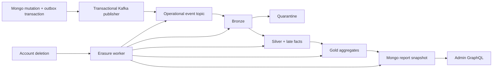

# MongoDB and analytics storage

[Wiki home](README.md) · [Canonical MongoDB design](../mongodb-design.md) · [Canonical analytics architecture](../big-data-architecture.md) · [Use cases](../use-cases.md)

This is a source inventory checked on 2026-10-08. It describes collections the code owns or accesses, not a live database inventory. Collections may be created lazily or only when an optional runtime is enabled. MongoDB is operational truth; Kafka and Delta are downstream boundaries. Implementation and local tests do not certify deployed availability, physical erasure, Atlas retrieval, or performance SLOs.

## Collection inventory

The inventory contains **35 MongoDB collection names**: 30 in the operational migration ownership set and five additional analytics runtime collections. Sources are [operational names](../../src/main/scala/com/example/graphQL/cats/repository/mongo/MongoNames.scala), [migration ownership](../../src/main/scala/com/example/graphQL/cats/repository/mongo/MongoHiringMigrations.scala), [producer registry names](../../src/main/scala/com/example/graphQL/cats/repository/mongo/MongoProducerRegistrations.scala), and the [analytics storage inventory](../../analytics/src/main/scala/com/example/hiring/analytics/service/batch/AnalyticsStorageInventory.scala). MongoDB's ordinary unique `_id` index applies throughout; secondary indexes below are selected important indexes, not an exhaustive index DDL listing.

### Accounts and hiring

| Collection | Purpose and relationships | Integrity, lifetime, use cases |
|---|---|---|
| `users` | Candidate, Recruiter and Admin accounts; credentials and role-specific embedded profile; candidate vector and embedding metadata | Unique canonical name, sparse unique canonical email, partial unique Admin singleton key; active/deleted account and revision predicates. Deleted accounts retain a tombstone; deletion removes candidate vector/metadata. Accounts underpin every authorized use case; candidate discovery UC06/UC10. |
| `account_registry` | Singleton `user-account-registry` document tracks account initialization/provisioning state | Transactional bootstrap coordination; not a second user directory. No TTL. Account/Admin provisioning. |
| `jobs` | Recruiter-owned job, status, skills, requirements, location and optional GeoJSON point/vector metadata | `jobs.recruiterId` references `users._id`; revision guards. Recruiter/status/created-time indexes, open/city indexes, `2dsphere` location index. Closing preserves the job record. UC01–04/06/07/08/10. |
| `applications` | Candidate/job association and current application status | Unique `(candidateId, jobId)` prevents duplicates. Candidate and job list indexes, with/without status, order by `(createdAt, _id)`. Submission and lifecycle writes are transactional. UC04/05/08/09. |
| `application_events` | Separate append-only lifecycle history with previous/new status, actor, UTC occurrence time, feedback/reason | References application and actor; application/time/ID index. Current status and history commit together; history does not grow an embedded application array. UC04/05/08/09, downstream UC12/13. |
| `hiring_migration_ledger` | Migration identities, bounded progress and completed verification evidence | Supports restartable operational migrations and startup integrity checks; no TTL. Infrastructure prerequisite for all Mongo-backed use cases. |

IDs are UUID strings in BSON and typed UUIDs in the domain. Profiles, location, embedding metadata and other bounded owned values are embedded; users, jobs, applications and history have separate identities. Mongo does not enforce foreign keys: repository transactions and authorization-aware reads enforce relationships. Document `version` is a concurrency revision, not an API or embedding schema version.

### Retrieval and reliable event delivery

| Collection | Purpose and relationships | Integrity, lifetime, use cases |
|---|---|---|
| `embedding_work` | Durable work per searchable job/candidate profile, including generation, attempts and lease | Due-work index on state/availability/lease; enqueue during processing retains the active lease while advancing generation. Completion cannot discard a newer generation. UC02/06/10. |
| `search_sessions` | Stored bounded search results, actor and expiry for subsequent click attribution | Actor/time index and expiry TTL. Search work strips raw query text; private recruiter filters are excluded from telemetry. UC01/02/06/10 and click recording. |
| `search_session_work` | Durable pending search session plus search event to persist asynchronously | Claim index; lease-token guarded completion writes session/outbox atomically; retention TTL applies to Failed work. UC01/02/06/10/11. |
| `event_outbox` | Immutable operational envelope plus publication state, retries, lease, subject attribution and partition key | Mutation/outbox atomicity; claim index and subject-ID index. Published-only TTL on retention expiry; failed evidence is not discarded by that TTL. UC07/09/11 and search/application events. |
| `outbox_subject_fences` | Per-subject deletion/publication fencing and lease state | Deleted/lease index; persistent deleted-subject fence denies delayed replay. No blanket TTL. UC11 and account deletion. |
| `producer_registrations` | Bounded rows attributing transactional producer generations to affected subjects and producer kind | Subject/state and transactional-ID/state indexes. Active attribution never expires; only broker-confirmed fenced rows receive expiry. Operational and interview publication/deletion. |
| `outbox_claim_cursors` | Persisted scan position for fair, bounded outbox selection | `_id`-keyed cursor prevents repeatedly restarting a contended scan at the beginning. UC11. |
| `consumer_receipts` | Durable processed-event identities per consumer group | Unique `(consumerGroup, eventId)`; receipt TTL. Receipt persistence precedes Kafka offset acknowledgement. UC11. |
| `mutation_receipts` | Request fingerprint and stored outcome for an actor-scoped idempotent mutation | Unique `(operation, actorScope, idempotencyKey)`; expiry TTL. Matching retry returns the recorded result; conflicting reuse fails. Hiring/account mutations. |
| `event_quarantine` | Durable invalid Kafka record evidence, category and coordinates | Unique `(topic, partition, offset)` and expiry TTL. Failed quarantine persistence prevents offset progress. Null envelopes are represented explicitly. UC11. |

The decisive sources are [index definitions](../../src/main/scala/com/example/graphQL/cats/repository/mongo/MongoHiringIndexSetup.scala), [event repositories](../../src/main/scala/com/example/graphQL/cats/repository/mongo/MongoOperationalEventRepositories.scala), [search work repository](../../src/main/scala/com/example/graphQL/cats/repository/mongo/MongoSearchSessionWorkRepository.scala), and [producer registrations](../../src/main/scala/com/example/graphQL/cats/repository/mongo/MongoProducerRegistrations.scala).

### Interview scheduling and cleanup

These collections implement the [geographic discovery and scheduled interview extension](../use-cases.md#geographic-discovery-and-scheduled-interviews) alongside application lifecycle UC09. The fake-provider collections are durable local adapters, not evidence of a live external calendar/email integration.

| Collection | Purpose and relationships | Integrity and lifetime |
|---|---|---|
| `interview_workflows` | Durable scheduling state tied to application, candidate and recruiter; revision and pending workflow decisions | Candidate/ID and recruiter/ID indexes; guarded state transitions; completed evidence may receive retention expiry. |
| `interview_workflow_commands` | Durable commands to reserve/release calendar capacity or deliver notifications | Due and claim-expiry indexes plus workflow-ID lookup; claimed publication and retries survive restarts; completed-evidence TTL. |
| `interview_workflow_inbox` | Durable incoming message receipts and related workflow processing/quarantine evidence | Partial unique `(workflowId, messageId)` for `inboxReceipt` documents; other document types do not collide on absent identity. Workflow-ID lookup; completed-evidence TTL. |
| `fake_interview_calendar_reservations` | Local persisted reservation with participants, time interval and release key | Participant/interval index; unique release key supports repeatable release; completed-evidence TTL. |
| `fake_interview_calendar_participant_locks` | Participant guard documents used by the local calendar to serialize conflicting reservation attempts | `_id` guards participate in transaction coordination; no general TTL index. |
| `fake_interview_notification_receipts` | Durable local notification outcomes by recipient/workflow | Recipient/delivery-time and workflow indexes; deduplication plus completed-evidence TTL. |
| `interview_subject_cleanup` | Per-deleted-subject cleanup state and Kafka retention barriers | Active-state partial ordered index and state/request-time index support bounded sweeps. Cleanup retains attribution until linked records are removed; per-record failure does not abandon the sweep. |

See [interview storage and recovery contracts](../mongodb-design.md#local-geographic-and-interview-storage), [workflow migrations](../../src/main/scala/com/example/graphQL/cats/repository/mongo/MongoInterviewWorkflowMigrations.scala), and [cleanup integrity migrations](../../src/main/scala/com/example/graphQL/cats/repository/mongo/MongoInterviewCleanupIntegrityMigrations.scala).

### Analytics reports, deletion and runtime controls

| Collection | Owner and purpose | Integrity, lifetime, use cases |
|---|---|---|
| `analytics_erasure_requests` | Operational deletion creates work; analytics worker advances durable subject-erasure phases | State/request-time index, unique present receipt ID, expiry after completed-marker retention. Active work persists through Kafka and Delta barriers. Account deletion across UC11–13. |
| `analytics_erasure_completions` | Permanent completion ledger for deletion receipt lookup | Unique present receipt ID; no TTL. Completion is distinct from merely deleting current Delta rows. |
| `analytics_erasure_delta_files` | Worker evidence about physical Delta files requiring erasure verification | Subject-associated evidence; retention follows deletion-marker cleanup, not a blanket automatic TTL promise. |
| `analytics_worker_heartbeats` | Worker liveness/readiness leases | TTL on `leaseUntil`; process-lifetime operational evidence. |
| `analytics_report_snapshots` | Bounded, suppressed report projection read by Admin GraphQL | Published-state/as-of index; expiry TTL. Contains funnel, time-to-hire and skill-posting results; UC12/13. |
| `analytics_report_control` | Shared publication generation/revision and visibility control | CAS rejects stale publishers and deletion hides reports; persistent singleton control. |
| `analytics_report_runs` | Run reservation/publication receipt and range identity | Expiry TTL; guards repeat publication and offset-range identity. UC12/13. |
| `analytics_late_fact_replay_requests` | Analytics-owned replay request identity, selection digest, coordinates and recovery progress | Natural key combines lakehouse/request identity. Indexes support published detail compaction and receipt dependencies. No TTL removes immutable bindings; detailed coordinates can be compacted. |
| `analytics_streaming_activation` | Explicit time-bounded grant and evidence required to activate a streaming runtime | Persistent authorization control; expiry stops the query rather than silently allowing continued ingestion. |
| `analytics_streaming_lakehouses` | Persistent registration of a lakehouse under streaming ownership | Prevents ordinary batch ingestion from taking over a streaming lakehouse after shutdown. |
| `analytics_lakehouse_mutexes` | Exclusion between managed batch, erasure, maintenance and retirement operations on a normalized lakehouse URI | No TTL or automatic crash takeover. Recovery requires proving old owners stopped; does not exclude unmanaged storage writers. |
| `analytics_hmac_key_retirements` | Immutable evidence-bound retirement authorization per lakehouse/key | Majority reads and journaled majority writes; permanent evidence, not HMAC secret storage. |

The first seven collections are in operational migration ownership and are shared with analytics adapters. The final five are additional analytics-owned namespaces. See [analytics Mongo adapters](../../analytics/src/main/scala/com/example/hiring/analytics/adapter/mongo), [storage privacy/retention inventory](../../analytics/src/main/scala/com/example/hiring/analytics/service/batch/AnalyticsStorageInventory.scala), and [report publication](../../analytics/src/main/scala/com/example/hiring/analytics/adapter/mongo/MongoAnalyticsReportPublisher.scala).

## Mongo transaction and query design

- **Submission (UC04):** read a strict job ID/status/revision projection; transactionally guard the observed Open revision, insert application and initial history, and enqueue the operational event. The unique candidate/job index and job guard resolve duplicate-submission and job-close races.
- **Lifecycle change (UC09):** commit current state, append-only history and operational outbox together. Interview state/inbox/command persistence similarly uses Mongo transactions and conditional writes; Spark is absent from the operational decision path.
- **Account deletion:** atomically tombstone the account, clear candidate vector metadata, record durable erasure work/receipt, and perform bounded related operational changes. Independent workers complete cross-system cleanup. A successful API request means durable pending work, not immediate physical erasure everywhere.
- **Read optimization:** authorization predicates, optional filters, projection and deterministic keyset ordering are pushed into Mongo; nested reads are batched. Secondary indexes include unfiltered and status-filtered variants to serve actual pagination shapes. Geographic retrieval uses a `2dsphere` index.
- **Search:** ordinary Mongo indexes and Atlas Search/vector indexes are separate resources. [Atlas setup](../../src/main/scala/com/example/graphQL/cats/repository/mongo/MongoAtlasSearchSetup.scala) checks definitions/readiness; asynchronously indexed results are rechecked against authoritative eligibility. Local Mongo tests cannot establish Atlas correctness or latency.
- **Startup integrity:** [setup](../../src/main/scala/com/example/graphQL/cats/repository/mongo/MongoHiringSetup.scala), migrations and strict validators establish the active contract. Index setup verifies ordered keys, uniqueness, sparsity, partial predicates and TTL values; incompatible same-name definitions fail closed. Mongo transactions require replica-set infrastructure.

More indexes are not automatically better: they consume storage and amplify writes. Existing documentation records rejected partial outbox index candidates and observed claim contention. These findings remain workload-specific; this wiki adds no new benchmark claim.

## Delta datasets and supporting files

Paths are relative to the configured lakehouse root, from [AnalyticsLakehousePaths](../../analytics/src/main/scala/com/example/hiring/analytics/service/batch/AnalyticsLakehousePaths.scala). Dataset schemas live in [AnalyticsTableSchemas](../../analytics/src/main/scala/com/example/hiring/analytics/adapter/spark/AnalyticsTableSchemas.scala).

| Path | Data and purpose | Privacy / lifecycle |
|---|---|---|
| `bronze/operational_events` | Original bounded Kafka records plus coordinates; replayable input | Raw subject data; Bronze retention and physical erasure apply. |
| `quarantine/operational_events` | Invalid/conflicting input and quality evidence | Raw subjects possible; quarantine retention and erasure apply. |
| `silver/operational_events` | Validated, deduplicated operational facts | HMAC-pseudonymized subjects; retained analytical facts, not anonymous data. |
| `silver/late_operational_events` | Late facts held for controlled replay/admission | Pseudonymous subjects; explicit replay recovery and retention. |
| `gold/application_funnel` | Lifecycle transition activity | Suppressed aggregate cells; rebuildable, UC12. |
| `gold/time_to_hire` | Eligible time-to-hire statistics/percentiles | Suppressed aggregates; rebuildable, UC13. |
| `gold/job_skills` | Job-created skill posting activity | Suppressed aggregates; rebuildable. |
| `control/run_manifests` | Run identity, source-range and outcome evidence | Sanitized permanent Delta control. |
| `control/streaming_progress` | Durable microbatch progress and recovery journal | Sanitized Delta control; configured recovery retention. |
| `control/streaming_decisions` | Durable admission/processing decisions for microbatch recovery | Sanitized Delta control; configured recovery retention. |
| `control/hmac_key_registry` | Key identity and continuity verifier | Sanitized permanent Delta control; anchors reject changed/missing key material. |

`control/streaming_lineage` is a lineage control location, **not classified as a Delta table** by the storage inventory. Spark checkpoint directories own offset/commit state separately. Driver spill and `control/purge-rewrite-*` scratch copies are additional privacy-relevant surfaces; maintenance inventories and cleans recognized abandoned rewrite copies under the lakehouse mutex.

Defaults in [analytics configuration](../../analytics/src/main/resources/application.conf) include Bronze/quarantine 7 days, Silver 30 days, published snapshots 30 days, completed deletion markers 31 days, Delta vacuum safety 7 days and Delta log retention 30 days. These are configurable policies, not evidence that old physical files have already disappeared. Mongo TTL is asynchronous and applies only where an expiry field/index is installed; business correctness does not depend on instant deletion at the deadline.

## Analytics flow and operational boundary

The separate analytics build uses Scala 3.7.4 with Spark/Delta Scala 2.13 artifacts. Its [batch service](../../analytics/src/main/scala/com/example/hiring/analytics/service/batch/HiringAnalyticsBatch.scala) reads explicit bounded offset ranges; [streaming coordination](../../analytics/src/main/scala/com/example/hiring/analytics/service/streaming/StreamingBatchCoordinator.scala) handles microbatch recovery; [Spark adapters](../../analytics/src/main/scala/com/example/hiring/analytics/adapter/spark) perform transforms and Delta writes. Cats Effect resources own clients, the bounded Spark driver executor and cancellation/draining. Operational requests never wait for Spark.

The operational topic carries one unversioned seven-field envelope. Payloads omit raw search query/private filters, job descriptions, feedback and decline reasons. Validation, event-ID deduplication and durable processing are necessary because delivery is at least once. Interview command/result topics are separate protocols and are not interpreted as analytical hiring facts.

Gold uses distinct pseudonymized subjects for K=10 per-cell suppression; this does not establish formal anonymity. Job skill activity counts job-created facts. Lifecycle activity and time-to-hire use their documented eligible facts; `CANDIDATE_HIRED` is not counted as an extra lifecycle transition. Reports are bounded and published through generation/revision CAS, after quality checks; a blocked range cannot advance the report. Active deletion hides reports and prevents stale publication from restoring them.

Erasure combines broker-confirmed producer fencing, attributed outbox purge, captured Kafka barriers, Delta row/file/log cleanup and report rebuilding. Kafka cannot selectively delete a subject's records: completion waits for actual retention progress. HMAC pseudonyms preserve deletion matching; key continuity and retirement require their own evidence. See [erasure limits](../big-data-architecture.md#erasure-and-limits) and [continuous analytics acceptance](../specs/continuous-hiring-analytics.md). Streaming remains opt-in and grant-gated; local functional closure does not establish deployed latency or production activation.
