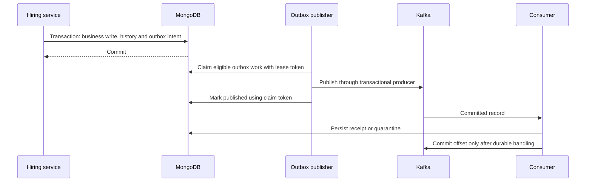

# Workflows and design patterns

[Wiki home](README.md) · [Domain/use cases](domain-and-use-cases.md) · [Storage](mongodb-and-analytics.md) · [Security](security-and-operations.md)

## Request execution

`Main` owns a Cats Effect `Resource` graph: typed configuration, telemetry, MongoDB/runtime setup, application services, request contexts, authentication/rate limits, routes, and Ember server. Resources release workers and clients on cancellation/shutdown. [MongoHiringRuntime](../../src/main/scala/com/example/graphQL/cats/runtime/MongoHiringRuntime.scala) waits for successful setup before starting Kafka/interview runtimes. Embedding workers have a setup-readiness gate.

An HTTP request passes size/admission/timeout controls and authentication, then Sangria parsing/validation/reducers, a request context, resolvers, service authorization, and repository access. The [Sangria adapter](../../src/main/scala/com/example/graphQL/cats/api/graphql/HiringGraphQLSangriaAdapter.scala) owns `IO`/`Future` conversion and framework exception translation. Business errors remain typed in use cases and repositories. [Fetchers](../../src/main/scala/com/example/graphQL/cats/api/graphql/HiringGraphQLFetchers.scala) batch nested relationships within a request; database queries still enforce the actor's scope.

## Hiring writes: UC04, UC06–UC09

Application submission and status changes use pure domain decisions followed by transactional persistence. The transaction protects the application write, append-only application history, and associated publication intent. Revisions and predicates detect stale state; unique indexes enforce candidate/job uniqueness. Job/actor state is checked at the write boundary so a preliminary authorization read is not the only protection against a concurrent close or account change.

[LifecycleProgram](../../src/main/scala/com/example/graphQL/cats/domain/policy/LifecycleProgram.scala) is `StateT[Either[DomainError, *], S, A]`: a transition either produces a new immutable state/result or a typed rejection. It does not itself open a database transaction, publish an event, or run a distributed workflow. See [application policy](../../src/main/scala/com/example/graphQL/cats/domain/policy/ApplicationLifecycle.scala), [submission policy](../../src/main/scala/com/example/graphQL/cats/domain/policy/ApplicationSubmission.scala), and [Mongo application adapter](../../src/main/scala/com/example/graphQL/cats/repository/mongo/MongoApplicationRepository.scala).

[Idempotent](../../src/main/scala/com/example/graphQL/cats/service/mutation/Idempotent.scala) scopes a request key by operation and actor, checks its fingerprint, and executes the write through the receipt repository. The receipt and business write share a transaction. Reusing a key with different input is a conflict; replay resolves the recorded entity through the use case. Receipts have a seven-day retention horizon, so this is not an unlimited deduplication promise.

[MongoTransactionRunner](../../src/main/scala/com/example/graphQL/cats/repository/mongo/MongoTransactionRunner.scala) distinguishes transient transaction errors from unknown commit results. It retries the whole transaction or only commit as appropriate, with bounded exponential backoff. Resource finalization aborts active transactions. Typed business rejection aborts rather than committing partial state. Transactional operation requires MongoDB replica-set infrastructure.

## Search and embedding: UC01–UC03, UC10

Structured search, nearby discovery, semantic retrieval and candidate matching share authorization/eligibility constraints but have different retrieval paths. [SemanticSearchService](../../src/main/scala/com/example/graphQL/cats/service/search/SemanticSearchService.scala) validates inputs, prepares query/job embeddings and delegates bounded retrieval. [MongoSemanticSearchRepository](../../src/main/scala/com/example/graphQL/cats/repository/mongo/MongoSemanticSearchRepository.scala) applies eligibility during database retrieval and final selection; it hydrates selected results rather than returning unrestricted candidate records.

Hybrid ranking combines vector and lexical branches. [HybridRankFusion](../../src/main/scala/com/example/graphQL/cats/service/search/HybridRankFusion.scala) uses reciprocal-rank fusion with constant 60, removes repeated IDs within a branch, and resolves ties deterministically by branch ranks and ID. [SearchFusionStrategy](../../src/main/scala/com/example/graphQL/cats/domain/search/SearchFusionStrategy.scala) also exposes Mongo rank/score fusion; optional Mongo reranking is configuration-dependent and needs a supporting Atlas deployment. The default application strategy does not prove native Atlas acceptance.

[SearchEvaluationHarness](../../src/main/scala/com/example/graphQL/cats/service/search/SearchEvaluationHarness.scala), [capture](../../src/main/scala/com/example/graphQL/cats/service/search/SearchEvaluationCapture.scala), and [metrics](../../src/main/scala/com/example/graphQL/cats/service/search/SearchEvaluationMetrics.scala) support reproducible retrieval assessment with labeled cases, ranked results and relevance metrics. [Assessment](../../src/main/scala/com/example/graphQL/cats/service/search/SearchEvaluationAssessment.scala) and [artifact rendering](../../src/main/scala/com/example/graphQL/cats/infrastructure/search/SearchEvaluationArtifacts.scala) make the evidence inspectable. These evaluation tools support UC02/UC06/UC10; they do not turn an unmeasured configured strategy into a quality or latency guarantee. See [search evaluation](../search-evaluation.md) for execution and evidence contracts.

Candidate matching uses the owned job and optional query inputs, applies visibility and structured filters, and returns a restricted candidate-match profile. Nearby discovery uses geographic distance with deterministic distance/ID continuation. Exact facets cover the eligible filtered set before page selection; independently requested hits and facets do not promise a shared snapshot.

Embedding writes are asynchronous. Account/job changes enqueue durable work in their transaction; an in-memory wake-up helps latency but is not the durable record. [EmbeddingPipeline](../../src/main/scala/com/example/graphQL/cats/service/search/EmbeddingPipeline.scala) uses bounded concurrency, claims/leases, retry policy, and source hash/model checks. [Preparation](../../src/main/scala/com/example/graphQL/cats/service/search/EmbeddingPreparation.scala) derives model input; [VoyageEmbeddingService](../../src/main/scala/com/example/graphQL/cats/infrastructure/embedding/VoyageEmbeddingService.scala) validates provider output including model identity and finite vector values. Repository completion checks prevent stale work from overwriting newer source data. Recovery distinguishes obsolete source, contention and terminal provider failure; see [EmbeddingRecoveryPolicy](../../src/main/scala/com/example/graphQL/cats/service/search/EmbeddingRecoveryPolicy.scala).

Search-session telemetry uses [SearchSessionHandoff](../../src/main/scala/com/example/graphQL/cats/service/events/SearchSessionHandoff.scala) and a durable work repository. A successfully stored handoff can be recovered by a worker, which records session/publication intent. Enqueue failure is diagnosed without failing search delivery; a search response alone therefore does not guarantee telemetry persistence. Explicit job-view/result-click use cases validate their session/subject relationships separately.

## Durable event delivery: UC11

MongoDB and Kafka do not share a transaction. A crash after Kafka publication but before Mongo acknowledgement can produce replay; the contract is at-least-once with idempotent handling. The [operational envelope](../../src/main/scala/com/example/graphQL/cats/service/events/OperationalEvent.scala) has seven active fields, without an added schema-version field.

[OperationalEventKafkaRuntime](../../src/main/scala/com/example/graphQL/cats/infrastructure/kafka/OperationalEventKafkaRuntime.scala) claims bounded publication waves, renews active leases, serializes transactional producer access, and replaces fenced producer generations. It marks failures/retries through guarded repository operations. Consumers use `read_committed`. Malformed data, including null records, must be durably quarantined before advancing offsets; an undurable record stops that partition's progress instead of allowing a later offset to skip it. See [partition processing](../../src/main/scala/com/example/graphQL/cats/infrastructure/kafka/KafkaPartitionProcessing.scala).

## Scheduled interviews: UC09 extension

[InterviewSchedulingService](../../src/main/scala/com/example/graphQL/cats/service/application/InterviewSchedulingService.scala) accepts a future UTC interval for an Accepted application to an owned job and stores durable workflow intent. Pure [workflow policy](../../src/main/scala/com/example/graphQL/cats/domain/workflow/InterviewWorkflowPolicy.scala) selects commands and state transitions; the [worker](../../src/main/scala/com/example/graphQL/cats/service/application/InterviewWorkflowWorker.scala) interprets them using repositories and provider ports.

The workflow reserves both participants, commits Accepted → Interview plus history and notification intent atomically, and delivers candidate/recruiter notifications. Half-open intervals allow adjacent bookings and reject overlap. Before hiring commit, failed work can release a reservation; after commit, notification problems require forward recovery. Deadline, attempt limits, leases, revisions, inbox receipts, outbox commands/replies, and producer-generation fencing constrain replay and stale workers.

This is a concrete Saga: local transactions coordinate steps with compensation where valid. An Admin repair request carries an expected revision and idempotency key and reconciles persisted provider receipts. Repair does not extend the original deadline or reopen a released reservation. It can remain in visible repair if safe completion is impossible. The configured runtime uses [durable fake calendar and notification providers](../../src/main/scala/com/example/graphQL/cats/service/port/InterviewProviders.scala); real calendar/email integrations, cancellation and rescheduling are not delivered by those adapters.

## Account deletion and analytics: account extension, UC11–UC13

Deletion coordinates an operational tombstone with durable erasure work, embedding cleanup and interview-subject cleanup. Workers remove or suppress downstream subject data and preserve progress across retries. This is forward recovery: a tombstone and elapsed retention cannot be undone by a compensating transaction. Kafka producer fencing/retirement and retention barriers prevent stale publication from reintroducing erased subjects; Delta erasure and guarded report publication have their own ownership and completion gates. See [storage and analytics](mongodb-and-analytics.md) and [analytics erasure safety specification](../specs/analytics-erasure-safety.md).

## Pattern catalog and concrete benefit

| Pattern/mechanism | Where used | Why it exists / limit |
|---|---|---|
| Ports and adapters; dependency inversion | Service-owned repositories/providers; Mongo/Kafka/HTTP adapters | Tests and business services depend on business contracts, with external failures translated at adapters |
| Functional core and effectful orchestration | Domain policies versus services/runtime | Deterministic rules can be tested with explicit time/IDs; effects remain resource-owned |
| State transition program (`StateT`) | Job/application lifecycle and workflow decisions | Combines validated immutable transitions; persistence remains a separate responsibility |
| Typed error channels (`Either`, `EitherT`) | Domain, `UseCaseIO`, `RepositoryIO` | Expected rejection is explicit and composable; framework exceptions are handled at the boundary |
| Accumulating validation (`ValidatedNec`) and refined values | Configuration and independent input checks | Reports multiple invalid settings before acquiring runtime dependencies |
| Unit of work / Mongo transaction | Mutation receipt, business write, history and outbox | Keeps locally related writes atomic under concurrency |
| Optimistic concurrency / compare-and-set | Revisions, expected states, claim tokens | Rejects stale mutations or workers without an unbounded in-memory lock |
| Transactional outbox and inbox/receipt deduplication | Operational publication and interview messages | Decouples broker availability from a committed intent and makes replay manageable |
| Leased work queue with fencing | Embeddings, publication, interviews, cleanup | Supports bounded concurrent processing and rejects stale owners; each workflow has its own recovery policy |
| Saga / process manager | Interviews and account erasure | Coordinates multiple durable steps without pretending external systems share one transaction |
| Strategy | Application RRF / Mongo fusion, provider ports | Allows concrete retrieval or adapter alternatives behind stable contracts |
| Request-scoped DataLoader/fetcher | Nested GraphQL entities | Reduces N+1 reads without sharing actor-specific results between requests |
| Materialized views / read projections | Mongo analytics reports, Delta Gold | Serves bounded Admin queries without executing Spark in an HTTP request |
| Controlled denormalization | Search eligibility, embedding metadata, submission snapshots | Avoids expensive joins and preserves historical context; source revisions/revalidation constrain staleness |

Application history is append-only audit data, but operational state is stored directly in MongoDB. The code does not rebuild all hiring state by replaying history, so describing the entire platform as event-sourced would be inaccurate.

## Optimization mechanisms and measurement boundaries

Database predicates, projections, indexes, keyset pagination, selected-result hydration and request batching reduce work. Search branch sizes, discovery permits/timeouts, embedding parallelism, Kafka claim waves, and analytics batch/stream budgets bound resource use. The [document cache](../../src/main/scala/com/example/graphQL/cats/api/graphql/GraphQLDocumentCache.scala) retains at most 256 parsed/validated documents for 60 seconds; it caches syntax, not user data or authorization decisions.

These mechanisms describe implementation intent and behavior, not a universal latency improvement. Query plans, fixture sizes, latency percentiles, claim amplification, Atlas acceptance and deployed SLOs remain recorded in [MongoDB design](../mongodb-design.md), [search evaluation](../search-evaluation.md), and the [milestones](../development-milestones.md). This documentation task does not rerun benchmarks or infer production throughput from unit tests.
